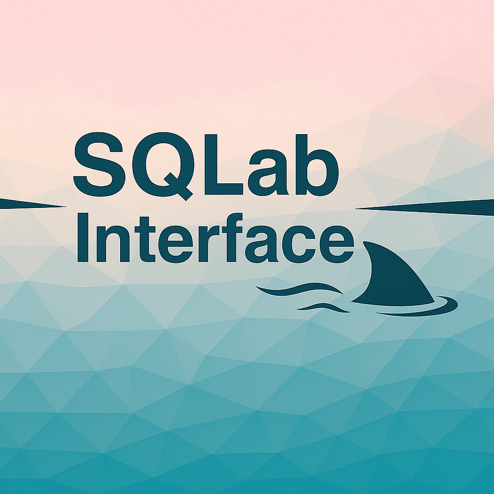

# SQLab Interface

A web-based interface for SQLab adventures, allowing users to explore and interact with SQL-based puzzle games in an intuitive environment.

## Overview

SQLab Interface provides a modern, browser-based GUI for SQLab adventures - educational text-based games where players solve puzzles using SQL queries. This interface connects to the SQLab database and offers a more streamlined experience than generic database tools.

## Features

- **SQL Query Execution**: Write and execute SQL queries with a dedicated editor
- **Table Explorer**: Browse tables with pagination and view their contents
- **Dark/Light Mode**: Toggle between dark and light themes for comfortable viewing
- **Responsive Design**: Clean, intuitive layout that works across various screen sizes
- **Drag and Drop Interface**: Rearrange tables for customized workspace organization

## Getting Started

### Prerequisites

- Node.js (v12 or higher)
- NPM (v6 or higher)
- MariaDB/MySQL database with a SQLab adventure loaded

### Installation

1. Clone the repository:
   ```
   git clone https://github.com/yourusername/sqlab-interface.git
   cd sqlab-interface
   ```

2. Install dependencies:
   ```
   npm install
   ```

3. Configure the database connection:
   Edit the `server.js` file to update your database credentials:
   ```javascript
   const pool = mariadb.createPool({
     host: 'localhost',
     port: 3307,
     database: 'sqlab_island',  // Change to your SQLab database
     user: 'root',              // Update with your username
     password: 'pass',       // Update with your password
     connectionLimit: 5
   });
   ```

4. Start the server:
   ```
   node server\server.js
   ```

5. Access the interface in your browser:
   ```
   http://localhost:3000
   ```

## Usage

1. **Executing Queries**:
   - Enter your SQL query in the text area at the top of the screen
   - Click the "Play" button or press Ctrl+Enter to execute
   - View results in the Execution tab

2. **Exploring Tables**:
   - Click on the "Business Tables" tab to see all available tables
   - Click on a table name to expand and view its contents
   - Use pagination controls to navigate through large tables

3. **Using Dark Mode**:
   - Click the moon/sun icon in the top right to toggle between light and dark themes

## Project Structure

```
/
├── public/             # Client-side code and assets
│   ├── controllers/    # Client-side controllers
│   ├── data/           # TSV data files
│   ├── models/         # Client-side data handling
│   ├── styles/         # CSS stylesheets
│   ├── utils/          # Utility functions
│   ├── views/          # UI rendering components
│   ├── index.html      # Main application page
│   ├── main.js         # Main client-side JavaScript
│   └── tsv-loader.js   # Utility for loading TSV files
├── server/             # Server-side code
│   ├── controllers/    # Express controllers
│   ├── middlewares/    # Custom middlewares
│   ├── routes/         # Express routes
│   ├── services/       # Business logic and DB services
│   ├── utils/          # Server utilities
│   └── server.js       # Main Express server 
├── README.md           # Project documentation
└── package.json        # Project dependencies and scripts
```


